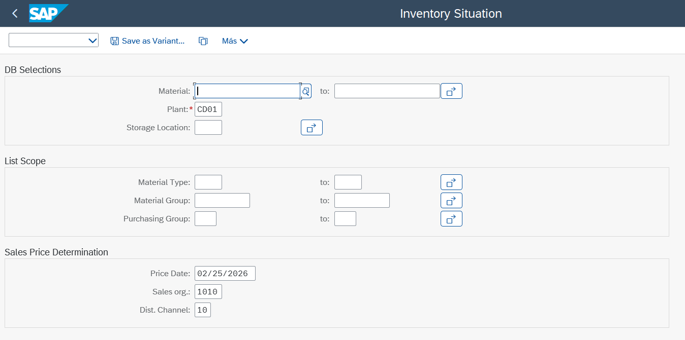

# My_Sap_Codes
Sap Codes of my Personal Programs

# My_Sap_Codes
Sap Codes of my Personal Programs

## ZSD_SHDB: Dynamic Batch Input Tool via Excel
### Overview
This ABAP utility simplifies mass data uploads by integrating directly with Transaction SHDB (Transaction Recorder). It automates the gap between recording a transaction and executing a Batch Input, eliminating the need for custom coding for every different upload.
### Key Features
* **Template Generation:** Automatically generates and downloads an Excel template based on the data structure of a specific SHDB recording.
* **Data Upload:** Reads the populated Excel file and maps the data back to the recording fields.
* **Dynamic Execution:** Executes the Batch Input (BDC) session for any transaction recorded in SHDB.
* **Portability:** Designed as a standalone report, making it easy to deploy across different SAP landscapes.
### How it Works
1. **Record:** Create a recording in SHDB for the target transaction.
2. **Download:** Run this program to export the required structure to Excel.
3. **Fill:** Populate the Excel file with your data.
4. **Upload & Process:** Use the program to upload the file; it will trigger the Batch Input.
### ZSD_SHDB: Dynamic Batch Input Tool

---
## ZMM_INVENTORY_SITUATION: Advanced Stock & Profitability Analyzer
### Overview
A comprehensive inventory management tool designed to provide a real-time 360° view of stock levels. It goes beyond standard SAP stock reports by calculating the **net available inventory** after considering all pending inbound and outbound documents, while simultaneously providing a financial valuation of the warehouse.
### Key Features
* **Dynamic Stock Calculation:** Fetches current stock by Storage Location and calculates the net availability.
* **Pending Documents Integration:**
    * **Inbound:** Tracks pending Purchase Orders (including overdue ones).
    * **Outbound:** Monitors pending Stock Transport Orders (STO), Sales Orders, and Outbound Deliveries pending Goods Issue (PGI).
* **Financial Valuation:** * Integrates **Valuated Cost** from material master data.
    * Fetches **Sales Price** to calculate the total market value of the current stock.
* **Profitability Analysis:** Automatically calculates **Theoretical Profit** based on the gap between total cost and potential sales revenue.
### Business Value
This report serves as a decision-making dashboard for Warehouse Managers and Controllers, allowing them to identify stock-outs before they happen and understand the financial impact of their current inventory.
### 🛠 Technologies & Technical Skills
This repository demonstrates advanced ABAP programming techniques:
* **Object-Oriented ALV:** Implemented using the modern `CL_SALV_TABLE` class for dynamic and interactive reporting.
* **SAP Business API (BAPI):** Integration with standard BAPIs (like `BAPI_MATERIAL_STOCK_REQ_LIST`) for accurate, real-time stock and requirement calculations.
* **Advanced SQL Performance:** Optimized data fetching using `INNER JOINS`, `LEFT OUTER JOINS`, and `FOR ALL ENTRIES` to ensure high performance even with large datasets.
* **Complex Data Structures:** Efficient use of `Internal Tables` (Standard and Hashed) and `Field Symbols` for memory-efficient data processing.
### 📂 Documentation (Functional & Technical)
You can find the full analysis of these developments in the [docs/](./docs) folder:
* **Functional Specifications:** Business requirements, logic flow, and user impact analysis.
* **Technical Specifications:** Detailed data mapping, table structures, and logic implementation details.
### 📸 Visual Demo

  
   
  <i>Selection Screen with dynamic filters and valuation parameters.</i>

  
   
  <i>Final ALV Output showing real-time stock availability and profitability analysis.</i>

---
